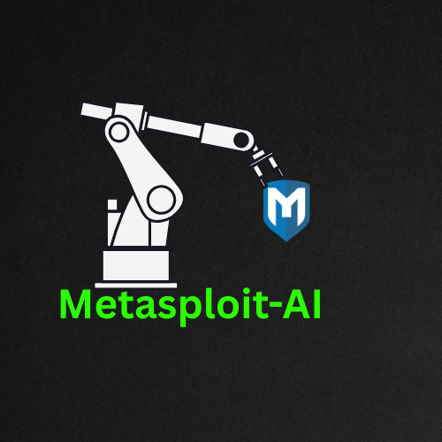

# 🤖 Metasploit-AI Framework

<p align="center">
  
</p>

**Advanced AI-Powered Penetration Testing and Cybersecurity Framework**

[](https://opensource.org/licenses/Apache-2.0)
[](https://www.python.org/downloads/)
[](https://github.com/yashab-cyber/metasploit-ai)
[](https://github.com/yashab-cyber/metasploit-ai)
[](https://www.zehrasec.com)

## 🚀 Overview

Metasploit-AI is a cutting-edge cybersecurity framework that combines the power of Metasploit with advanced artificial intelligence and machine learning capabilities. Designed for cybersecurity professionals, ethical hackers, and penetration testers, this framework automates and enhances traditional penetration testing workflows with intelligent vulnerability assessment, exploit recommendation, and payload optimization.

**Created by [Yashab Alam](https://github.com/yashab-cyber), Founder & CEO of [ZehraSec](https://www.zehrasec.com)**

## ✨ Features

### 🧠 AI-Powered Core
- **Intelligent Vulnerability Analysis**: Machine learning models for vulnerability classification and risk assessment
- **Smart Exploit Recommendation**: AI-driven exploit selection based on target characteristics
- **Adaptive Payload Generation**: Dynamic payload creation and optimization using neural networks
- **Automated Evasion**: AI-based techniques to evade detection systems

### 🔍 Advanced Scanning
- **Multi-threaded Network Scanning**: Fast and comprehensive network reconnaissance
- **Service Enumeration**: Detailed service detection and version identification
- **OS Fingerprinting**: Advanced operating system detection
- **Stealth Scanning**: Evasive scanning techniques to avoid detection

### 💥 Intelligent Exploitation
- **Automated Exploit Execution**: Smart exploit chaining and execution
- **Success Probability Prediction**: ML-based exploit success rate estimation
- **Session Management**: Advanced post-exploitation session handling
- **Real-time Monitoring**: Live exploitation status and progress tracking

### 🌐 Multi-Interface Support
- **Web Interface**: Modern, responsive web dashboard with Bootstrap 5
- **Desktop GUI**: CustomTkinter-based desktop application with dark theme
- **CLI Interface**: Rich command-line interface with syntax highlighting and auto-completion
- **REST API**: Comprehensive API endpoints for integration and automation
- **Real-time Updates**: WebSocket support for live updates across all interfaces

### 📊 Comprehensive Reporting
- **Automated Report Generation**: AI-enhanced penetration testing reports
- **Risk Assessment**: Intelligent risk scoring and prioritization
- **Compliance Mapping**: NIST, OWASP, and other framework alignment
- **Executive Summaries**: Business-focused security summaries

## 🛠️ Installation

### Prerequisites

- **Python 3.8+**
- **Metasploit Framework**
- **Operating System**: Linux (Kali Linux recommended), macOS, or Windows WSL

### Quick Install

```bash
# Clone the repository
git clone https://github.com/yashab-cyber/metasploit-ai.git
cd metasploit-ai

# Run the setup script
python setup.py

# Install dependencies
pip install -r requirements.txt

# Initialize the framework
python app.py --mode web
```

### Docker Installation

```bash
# Build the Docker image
docker build -t metasploit-ai .

# Run the container
docker run -d -p 8080:8080 --name msf-ai metasploit-ai
```

### Advanced Installation

For detailed installation instructions, including Metasploit setup and configuration, see the [Installation Guide](docs/installation.md).

## 🚀 Quick Start

### Interface Selection

The framework supports multiple interfaces to suit different use cases:

| Interface | Best For | Command |
|-----------|----------|---------|
| 🖥️ **CLI** | Automation, scripting, remote access | `python app.py --mode cli` |
| 🌐 **Web** | Team collaboration, remote access | `python app.py --mode web` |
| 🖱️ **GUI** | Desktop users, visual workflow | `python app.py --mode gui` |

### 1. Web Interface (Recommended for Teams)

```bash
# Start the web interface
python app.py --mode web --host 0.0.0.0 --port 8080

# Open your browser to http://localhost:8080
# Default credentials: admin/admin
```

**Features:**
- Modern Bootstrap 5 dashboard
- Real-time updates via WebSocket
- Multi-user session management
- Responsive design for mobile/tablet
- Comprehensive API endpoints

### 2. Desktop GUI Interface (Recommended for Desktop Users)

```bash
# Install GUI dependencies
pip install customtkinter pillow

# Start the desktop GUI
python app.py --mode gui
```

**Features:**
- Modern dark-themed interface with CustomTkinter
- Native desktop integration
- Real-time scanning and exploitation
- AI-powered recommendations and analysis
- Interactive session management
- Comprehensive reporting tools
- Drag-and-drop target import

### 3. Command Line Interface (Default - Recommended for Automation)

```bash
# Start the CLI
python app.py --mode cli

# Basic commands
msf-ai> status                    # Check framework status
msf-ai> scan 192.168.1.0/24      # Scan network
msf-ai> recommend                 # Get exploit recommendations
msf-ai> exploit 1                 # Execute recommended exploit
msf-ai> sessions list             # List active sessions
```

### 4. API Usage (Coming Soon)

```bash
# API mode will be available in future releases
# Currently available through web interface endpoints
python app.py --mode web --port 8080

# Example API calls
curl -X POST http://localhost:8080/api/scan \
  -H "Content-Type: application/json" \
  -d '{"target": "192.168.1.100", "scan_type": "comprehensive"}'
```

## 📖 Usage Examples

### Automated Penetration Testing

```python
# Python API example
from src.core.framework import MetasploitAIFramework
from src.core.config import Config

# Initialize framework
config = Config.load_config()
framework = MetasploitAIFramework(config)
await framework.initialize()

# Run automated penetration test
targets = ["192.168.1.100", "192.168.1.101"]
results = await framework.automated_penetration_test(targets)

# Generate report
report = await framework.report_generator.generate_pentest_report(results)
```

### Custom Vulnerability Analysis

```python
# Advanced vulnerability analysis
scan_result = await framework.scan_target("192.168.1.100", "comprehensive")
vulnerabilities = await framework.vuln_analyzer.analyze(scan_result)

# Get AI recommendations
recommendations = await framework.recommend_exploits("192.168.1.100", vulnerabilities)

# Execute top recommendation
if recommendations:
    result = await framework.execute_exploit(
        "192.168.1.100", 
        recommendations[0]['exploit_name']
    )
```

## 🔧 Configuration

### Basic Configuration

Edit `config/default.yaml`:

```yaml
framework:
  name: "Metasploit-AI"
  version: "1.0.0"
  debug: false

metasploit:
  host: "127.0.0.1"
  port: 55553
  username: "msf"
  password: "msf"

ai:
  enabled: true
  models_path: "data/models"
  openai_api_key: "your-openai-key"

security:
  api_key_required: true
  rate_limit: 100
  max_concurrent_scans: 5
```

### Advanced Configuration

For advanced configuration options, see the [Configuration Guide](docs/configuration.md).

## 🤖 AI Models

The framework includes several pre-trained AI models:

- **Vulnerability Classifier**: Categorizes and scores vulnerabilities
- **Exploit Recommender**: Suggests optimal exploits for targets
- **Payload Optimizer**: Generates and optimizes payloads
- **Evasion Engine**: Applies anti-detection techniques

### Training Custom Models

```bash
# Train vulnerability classifier
python scripts/train_models.py --model vulnerability_classifier --data data/vulns.csv

# Train exploit recommender
python scripts/train_models.py --model exploit_recommender --data data/exploits.csv
```

## 📊 Reporting

### Report Types

- **Executive Summary**: High-level business impact analysis
- **Technical Report**: Detailed vulnerability and exploit information
- **Compliance Report**: NIST, ISO 27001, PCI DSS compliance mapping
- **Remediation Guide**: Step-by-step fix recommendations

### Custom Reports

```python
# Generate custom report
from src.modules.report_generator import ReportGenerator

generator = ReportGenerator(config)
report = await generator.generate_custom_report(
    scan_results=results,
    template="custom_template.html",
    include_charts=True,
    include_raw_data=False
)
```

## 🔒 Security Considerations

### Ethical Usage

⚠️ **IMPORTANT**: This framework is designed for authorized penetration testing and security research only. Users must:

- Obtain proper authorization before testing any systems
- Comply with all applicable laws and regulations
- Use responsibly and ethically
- Not use for malicious purposes

### Security Features

- **Audit Logging**: Comprehensive logging of all activities
- **Access Control**: Role-based access control and API keys
- **Encryption**: Encrypted communications and data storage
- **Rate Limiting**: Protection against abuse and DoS

## 🤝 Contributing

We welcome contributions from the cybersecurity community!

### Development Setup

```bash
# Clone and setup development environment
git clone https://github.com/yashab-cyber/metasploit-ai.git
cd metasploit-ai

# Install development dependencies
pip install -r requirements-dev.txt

# Run tests
pytest tests/

# Run linting
flake8 src/
black src/
```

### Contribution Guidelines

1. Fork the repository
2. Create a feature branch (`git checkout -b feature/amazing-feature`)
3. Commit your changes (`git commit -m 'Add amazing feature'`)
4. Push to the branch (`git push origin feature/amazing-feature`)
5. Open a Pull Request

See [CONTRIBUTING.md](CONTRIBUTING.md) for detailed guidelines.

## 📚 Documentation

- [Installation Guide](docs/installation.md)
- [User Manual](docs/user-manual.md)
- [API Documentation](docs/api.md)
- [Developer Guide](docs/developer.md)
- [AI Models Documentation](docs/ai-models.md)

## 🧪 Testing

```bash
# Run all tests
pytest

# Run specific test category
pytest tests/test_scanner.py
pytest tests/test_ai_models.py
pytest tests/test_exploits.py

# Run with coverage
pytest --cov=src tests/
```

## 🐛 Troubleshooting

### Common Issues

1. **Metasploit Connection Failed**
   ```bash
   # Start Metasploit RPC server
   sudo msfconsole -x "load msgrpc ServerHost=127.0.0.1 ServerPort=55553 User=msf Pass=msf"
   ```

2. **AI Models Not Loading**
   ```bash
   # Download pre-trained models
   python scripts/download_models.py
   ```

3. **Permission Errors**
   ```bash
   # Fix permissions
   sudo chown -R $USER:$USER data/ logs/
   ```

For more troubleshooting help, see [TROUBLESHOOTING.md](docs/troubleshooting.md).

## 🤝 Contributing

We welcome contributions from the cybersecurity community! Please read our contributing guidelines before getting started.

### 📚 Documentation
- [Contributing Guide](CONTRIBUTING.md) - How to contribute to the project
- [Code of Conduct](CODE_OF_CONDUCT.md) - Community standards and expectations
- [Security Policy](SECURITY.md) - Security vulnerability reporting
- [Development Setup](docs/development.md) - Setting up your development environment
- [API Documentation](docs/api.md) - Complete API reference

### 🔒 Security
Please review our [Security Policy](SECURITY.md) for information on:
- Reporting security vulnerabilities
- Responsible disclosure guidelines
- Security best practices
- Bug bounty information

### 💰 Support the Project
If you find this project helpful, consider supporting its development:
- ⭐ Star the repository
- 🍴 Fork and contribute
- 💝 [Make a donation](DONATE.md)
- 📢 Share with the community

## 📄 License

This project is licensed under the Apache License 2.0 - see the [LICENSE](LICENSE) file for details.

## ⚠️ Disclaimer

This software is provided for educational and authorized testing purposes only. The authors and contributors are not responsible for any misuse or damage caused by this software. Users are solely responsible for ensuring they have proper authorization before using this tool on any systems.

## 🙏 Acknowledgments

- **Metasploit Framework** - The foundational exploitation framework
- **NIST Cybersecurity Framework** - Security guidelines and standards
- **OWASP** - Web application security methodology
- **CVE/NVD** - Vulnerability database and scoring
- **The Cybersecurity Community** - For continuous research and innovation

## 📞 Support & Contact

### 🌐 Connect with ZehraSec
- **Website**: [www.zehrasec.com](https://www.zehrasec.com)
- **Instagram**: [@_zehrasec](https://www.instagram.com/_zehrasec?igsh=bXM0cWl1ejdoNHM4)
- **Facebook**: [ZehraSec Official](https://www.facebook.com/profile.php?id=61575580721849)
- **X (Twitter)**: [@zehrasec](https://x.com/zehrasec?t=Tp9LOesZw2d2yTZLVo0_GA&s=08)
- **LinkedIn**: [ZehraSec Company](https://www.linkedin.com/company/zehrasec)

### 👨‍💻 Connect with Yashab Alam (Creator)
- **GitHub**: [@yashab-cyber](https://github.com/yashab-cyber)
- **Instagram**: [@yashab.alam](https://www.instagram.com/yashab.alam)
- **LinkedIn**: [Yashab Alam](https://www.linkedin.com/in/yashabalam)
- **Email**: yashabalam707@gmail.com

### 🔧 Technical Support
- **Documentation**: [Installation Guide](docs/installation.md)
- **Issues**: [GitHub Issues](https://github.com/yashab-cyber/metasploit-ai/issues)
- **Discussions**: [GitHub Discussions](https://github.com/yashab-cyber/metasploit-ai/discussions)
- **WhatsApp Business**: [ZehraSec Channel](https://whatsapp.com/channel/0029Vaoa1GfKLaHlL0Kc8k1q)

---

<div align="center">

**Made with ❤️ by [Yashab Alam](https://github.com/yashab-cyber) and the [ZehraSec](https://www.zehrasec.com) Team**

*Advancing Cybersecurity Through AI Innovation*

</div>

[ZehraSec Website](https://www.zehrasec.com) • [GitHub Repository](https://github.com/yashab-cyber/metasploit-ai) • [Issues](https://github.com/yashab-cyber/metasploit-ai/issues) • [Documentation](docs/README.md)

</div>
